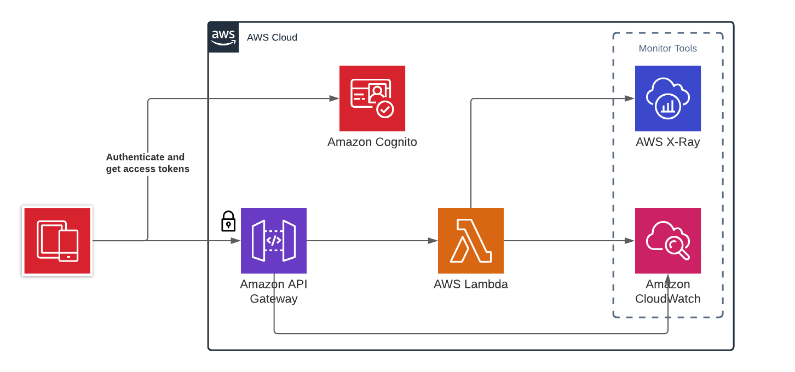

# Serveless fizz buzz API
REST API built with AWS services and terraform to manage and deploy all the services automatically.

### Architecture


### Folder Structure
- **lambda** - [docs](lambda/readme.md) - Contains the endpoint business logic written in Typescript
- **terraform** - [docs](terraform/readme.md) - Contains the terraform files with configurations of all the AWS services

### Steps to start the project

##### 1 - Build the lambda code
```sh
	cd lambda
	npm run compile # run unit, function tests and build the code
```

##### 2 - Deploy AWS service
```sh
	cd terraform
	terraform init
	terraform apply
```

### Endpoints

#### Authentication
AWS cognito endpoint to authenticate the user and get the **AccessToken** output variable

**Example:**
```sh
curl --location --request POST 'https://cognito-idp.eu-west-1.amazonaws.com' \
--header 'X-Amz-Target: AWSCognitoIdentityProviderService.InitiateAuth' \
--header 'Content-Type: application/x-amz-json-1.1' \
--data-raw '{
   "AuthParameters" : {
      "USERNAME" : "{{USERNAME}}",
      "PASSWORD" : "{{PASSWORD}}"
   },
   "AuthFlow" : "USER_PASSWORD_AUTH",
   "ClientId" : "{{ClientId}}"
}'
```

#### FizzBuzz 
**Endpoint:** /fizzbuzz

###### Input
| Parameter   | Type 								|
| ----------- | ------------------- |
| number      | integer							|

**Example:**
```sh
curl --location --request POST 'https://{{API_GATEWAY_URL}}/api-gateway-stage/fizzbuzz' \
--header 'Authorization: Bearer {{ACCESS_TOKEN}}' \
--header 'Content-Type: application/json' \
--data-raw '{
    "number": 3
}'
```

###### Output
| Parameter   | Type 								|
| ----------- | ------------------- |
| number      | integer							|
| result      | string							|

**Example:**
```json
{
  "number": 3,
  "result": "fizz"
}
```